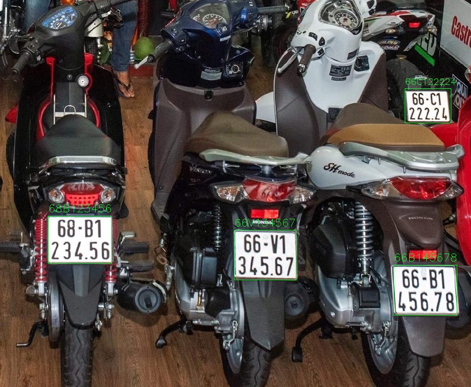
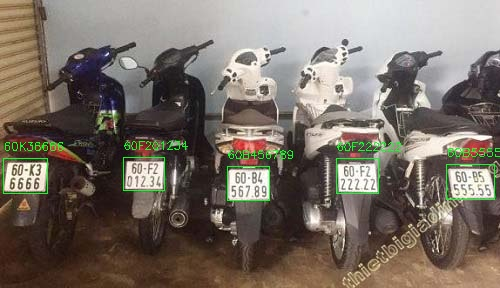

# License Plate Recognition
**VietNam License Plate Recognition**

This repository provides you with a detailed guide on how to build, train and use a Vietnamese License Plate Recognition system. This system can work on all types of plate in Viet Nam

## Data

This repo uses 2 sets of data for 2 stage of license plate recognition problem:

- [License Plate Detection Dataset](https://drive.google.com/drive/folders/1tY4kXbXt2DvV8viALZ01xVOEOefT4LAS?usp=sharing)
- [Optical Character Recognition Dataset](https://drive.google.com/drive/folders/13rMaHOKVlSpJaLdVrj8u1WMIRl0_q2vb?usp=sharing)

Thanks [Mì Ai](https://www.miai.vn/thu-vien-mi-ai/) and [winter2897](https://github.com/winter2897/Real-time-Auto-License-Plate-Recognition-with-Jetson-Nano/blob/main/doc/dataset.md) for sharing a part in this dataset

## Installation

```bash
  git clone https://github.com/pthang23/License_Plate_Recognition.git
  cd License_Plate_Recognition

  # Install Dependencies
  pip install -r ./requirement.txt
```

- **Pretrained models** provided in /model folder in this repo 

- **Training process** provided in /training folder in this repo

- **Support functions** provided in /processing_function folder in this repo

- **Test images** and its **result** provided in /test_image and /result_image folder in this repo

## Run License Plate Recognition

```bash
  # Run Inference On Webcam (15-20fps if there is 1 license plate in scene)
  python webcam_LP_recognition.py 

  # Run Inference On Image
  python LP_recognition.py -i test_image/test2.jpg

  # Run stepbystep_LP_recognition.ipynb If You Want To Know How Model Work In Each Step
```

## Demo Result




## Training

**You can retrain models using code in /training folder**

```bash
  training/plate_detection.ipynb                  #for LP_Detection
  training/optical_character_recognition.ipynb    #for OCR
```

## Reference

YOLOV5 by ultralytics ([YOLOV5](https://github.com/ultralytics/yolov5))
